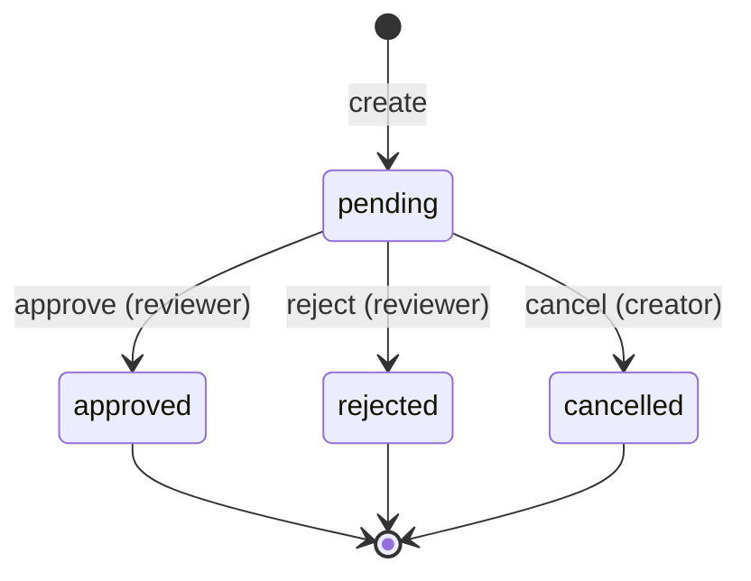

# DESIGN.md

Short design notes for `approval-service`: data model, service boundaries, retry/idempotency handling,
events/integration readiness, and known compromises. See [`README.md`](README.md) for run/test commands
and the full API reference; see [`CLAUDE.md`](CLAUDE.md) for the incremental build log and the empirical
reasoning behind specific decisions, if more detail than this document is useful.

## Data model

Five tables, all scoped by `workspace_id`:

| Table | Purpose |
|---|---|
| `approval_requests` | The aggregate root — one row per request, its current state, and (once decided) who decided it and why. |
| `approval_request_reviewers` | Join table: which external user ids may decide on a given request. |
| `audit_log_entries` | Append-only: one row per successful mutation — who changed what. |
| `outbox_events` | Append-only: one row per successful mutation — the event-integration trail. |
| `idempotency_keys` | One row per `(workspace_id, route, idempotency_key)` actually executed, storing the response to replay on retry. |

`approval_requests` carries a `UNIQUE(workspace_id, id)` constraint (in addition to its primary key `id`)
specifically so every child table can declare its foreign key as the **composite**
`(workspace_id, approval_request_id) → approval_requests(workspace_id, id)`, rather than just
`approval_request_id → approval_requests(id)`. That makes it a schema-enforced impossibility — not just
an application-level convention — for an audit entry, outbox event, or reviewer row to reference a
request belonging to a *different* workspace.

State machine — one-way, no exceptions:

Approve/reject/cancel are all implemented as a single conditional `UPDATE ... WHERE status = 'pending'`
— there is no row lock and no `SELECT ... FOR UPDATE`. Two concurrent decisions on the same request race
on that one `UPDATE`; exactly one can affect a row (the other affects zero rows and is reported back as
"already decided," `409`). This was verified with a real concurrent-request test
(`test_concurrent_decisions_only_one_wins`), not just reasoned about.

## Service boundaries

This service owns approval requests, their reviewers, the decision on each, the audit trail, and the
outbox event trail. It does **not** own — and never fetches, joins against, or validates the existence
of — publications, scenarios, edits, users, or workspaces themselves. Those are referenced purely by
opaque external id (`pub_123`, `usr_1`, `ws_1`, ...) supplied by the caller and trusted at face value; the
neighboring services that own that data are explicitly out of scope for this exercise.

Tenant (workspace) isolation is enforced at three independent layers, not just one:

1. **Auth** — the token's `workspace_id` must match the `{workspace_id}` in the URL, or the request is
   rejected (`401`/`403`) before any business logic runs.
2. **Repository queries** — every read and write filters explicitly by `workspace_id`.
3. **Schema** — the composite foreign keys described above make a cross-workspace reference structurally
   impossible, independent of whether the application code above remembered to filter correctly.

A request that exists but belongs to a different workspace than the one in the URL returns `404`, not
`403` — from the caller's perspective in workspace A, a request that belongs to workspace B is
indistinguishable from one that doesn't exist. (`403` is still used for the *auth* layer: a token whose
own workspace doesn't match the URL, which is about the caller's credentials, not about whether the
target resource exists.)

Authentication is a stub (`Authorization: Bearer <base64url(json)>`, unsigned — see README for the exact
format) sitting behind an `AuthProvider` interface, so a real implementation can replace it later without
any route or business-logic changes. Authorization has one nuance beyond the assignment's coarse action
list: `approval:decide` alone lets a user approve/reject *some* request in the workspace, but only if
they're also one of that specific request's listed reviewers (when the list is non-empty); similarly,
`approval:cancel` alone isn't enough to cancel a specific request — the caller must also be its creator.
Without this, the coarse action list would let any user holding it decide on or cancel *any* request in
the workspace, which defeats the purpose of `reviewerUserIds` being part of the request in the first
place.

## Retry / idempotency handling

An `Idempotency-Key` header, scoped per `(workspace_id, route, idempotency_key)`:

- **Required** on create — without one, retrying a client request that already succeeded would create a
  second, visibly duplicate resource, which the assignment explicitly rules out.
- **Optional** on approve/reject/cancel — the conditional-`UPDATE` state machine already makes retrying
  safe by itself (a bare retry of an already-applied decision just gets `409`, never a duplicate
  decision); the key upgrades that outcome into a clean replay of the original response instead of a
  conflict.

Mechanism: the request body is normalized (parsed and validated) and hashed; a first call with a given
key stores `(fingerprint, status, body)`. A second call with the same key: replays the stored response
untouched if the fingerprint matches, or returns `409` if it doesn't (the key was reused for a
meaningfully different request — a client bug). The idempotency record is written and flushed inside the
same database transaction as the mutation it describes, so the two can never disagree.

**Known limitation**: two *simultaneously* concurrent requests sharing the same fresh idempotency key,
exercised through the full HTTP stack in this project's test suite, both come back `409` rather than one
cleanly replaying the other's `201`. Neither ever produces a duplicate or a `500` — that guarantee holds
unconditionally — but the "one clean winner" outcome doesn't, specifically under the SQLite test harness
this project uses for speed (a single shared database connection across all sessions, which SQLAlchemy
itself documents as intended for single-owner test scenarios, not genuinely concurrent transactions). The
same style of test against the decision state machine (`test_concurrent_decisions_only_one_wins`) *does*
show the intended one-succeeds/one-conflicts split, because that path is a single atomic statement rather
than a short transaction with an extra round-trip in the middle — so this is believed to be a property of
the test harness, not of the design, and is expected to resolve cleanly against Postgres's real
per-connection isolation. Revisiting this against the dockerized Postgres instance is a natural next step
if this service moves toward a real deployment.

## Events & integration readiness

No message broker and no publisher process — both are deliberately out of scope (the assignment says not
to add real external services). What exists instead is the `outbox_events` table: every successful
mutation writes exactly one event row in the same transaction as the change it describes, so the two can
never drift apart (a change is never recorded without its event, or vice versa). `published_at` starts
`NULL`; a future publisher process — not part of this exercise — would poll
`WHERE published_at IS NULL ORDER BY created_at`, publish each row to whatever real broker is chosen, and
stamp `published_at`. No schema or application change would be needed to add that process later.

Event types: `approval_request.created`, `.approved`, `.rejected`, `.cancelled`. Payloads are
deliberately minimal — ids, `workspace_id`, resulting `status`, and (for decisions) `decided_by_user_id`
only. Titles, descriptions, comments, and reasons are never included; a consumer that needs them can look
the resource up by id. This keeps the event contract stable and small, and is also why event payloads
trivially satisfy the "no secrets in events" constraint — there's nothing in them beyond ids and enum
values to begin with.

## Known compromises

- **Auth is a stub, not real security** — unsigned, anyone can mint a valid-looking token. This is what
  the assignment asks for locally; a real deployment would swap `StubAuthProvider` for a real verifier
  behind the same `AuthProvider` interface.
- **No audit-log read endpoint.** The trail is captured completely (`audit_log_entries`), but there's no
  `GET` to browse it — not part of the assignment's minimal API. Straightforward to add later since the
  data is already there.
- **Single uvicorn worker**, no multi-process supervision — adequate for this exercise, would need
  addressing (e.g. gunicorn+uvicorn workers, or multiple replicas behind a load balancer) under real load.
- **Offset-based pagination**, not a keyset cursor. Fine at this scale; would need revisiting for
  workspaces with very large numbers of requests.
- **No rate limiting or request-size limits** beyond per-field `max_length` validation.
- **SQLite is test-only; Postgres is the real target.** Migrations are hand-reviewed after autogeneration
  specifically because Alembic's autogenerate has known gaps — e.g. it does not reliably detect `CHECK`
  constraint differences, which is exactly how the enum columns briefly shipped with no database-level
  validation at all until this was caught by testing directly against a real Postgres instance rather
  than trusting the SQLite-passing test suite alone.
- **No token expiry or revocation** — inherent to the stub having no real signature or session state.
